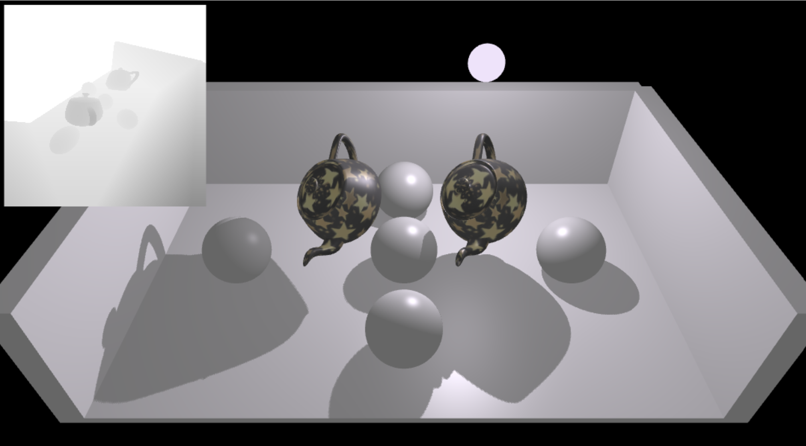

# Shadow Demo

This is a Tiny-Graphics demo about advanced shadow implementation that with 2 passes.

### Code Location

Most of the code are located in `./examples/shadow-demo.js`. You can copy that file into the `examples` folder of your repos (like assignments or team project), it should be compatible and you can import it as your main scene.

### References

https://webglfundamentals.org/webgl/lessons/webgl-shadows.html

https://learnopengl.com/Advanced-Lighting/Shadows/Shadow-Mapping